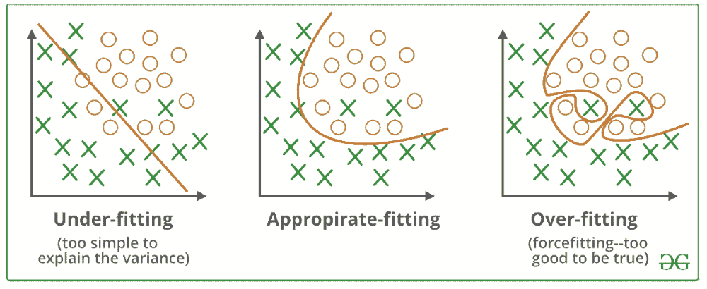
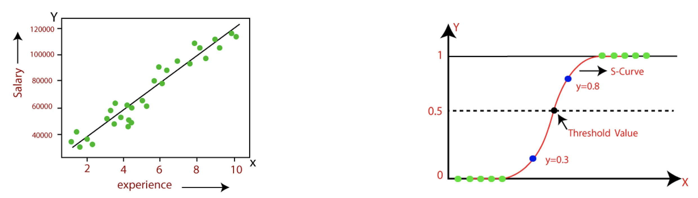

# 機器學習(Machine Learning)

- 人工智慧（Artificial Intelligence, AI）的一個重要分支。
- 它使計算機能夠通過數據進行學習並改進性能，而不需要明確的編程。

# But In Fact

## 1. 機器學習概念

### 1.1 機器學習定義

- 一種使計算機系統能夠通過數據來學習和做出預測或決策的技術。
- 通過數據驅動模型來解決複雜問題。
- 目標是讓系統能夠自動從經驗中學習，並在處理新數據時做出準確的預測或判斷。

### 1.2 監督學習與非監督學習

- **監督學習**（Supervised Learning）：在這種學習模式下，模型在訓練過程中使用帶有標籤的數據。每個訓練樣本都有一個對應的正確答案，模型的目標是學習從輸入到輸出的映射。

  **例子**：假設您要預測房屋價格。您可以使用包含房屋特徵（如面積、位置、房間數等）和實際價格的數據集進行訓練。模型學會將房屋特徵與價格對應起來，從而對新房屋進行價格預測。

- **非監督學習**（Unsupervised Learning）：與監督學習不同，非監督學習使用的數據沒有標籤。模型的目標是從數據中找到隱藏的模式或結構。

  **例子**：假設您有一組顧客數據，但不知道這些顧客可以被劃分成多少類。您可以使用聚類算法（如 K-means）來自動將顧客分成不同的群體，從而發現不同的顧客類型。

### 1.3 強化學習

**強化學習**（Reinforcement Learning）是一種通過與環境交互來學習的機器學習方法。它基於獎勵機制，模型或智能體(Agent)在每一步行動後獲得回報，通過試錯法來最大化累積回報。

**例子**：在遊戲中，強化學習可以用來訓練智能體自動玩遊戲。智能體在每一步行動後會根據得分（獎勵）來調整策略，最終學會如何玩得更好以獲得更高的得分。

## 2. 數據處理

### 2.1 數據清理(Data Cleaning & Data Preprocessing)

數據清理是數據預處理的第一步，包括處理缺失值、去除異常值和修正數據錯誤。

**例子**：如果您的數據集中有某些樣本的房屋價格缺失，您可能需要選擇填補缺失值（如使用平均值）或刪除這些樣本，以確保數據的完整性和準確性。

### 2.2 特徵工程

**特徵工程**（Feature Engineering）是從原始數據中提取和構建有用特徵的過程。好的特徵能夠顯著提高模型的性能。

**例子**：在預測房價的問題中，除了使用原始的面積和位置等特徵，您還可以創造新的特徵，如“每平方米價格”或“距離市中心的距離”，這些新特徵可能對預測結果有更好的影響。

### 2.3 數據標準化與正則化

- **數據標準化**（Data Normalization）：將數據轉換到相同的尺度，以提高模型的穩定性和收斂速度。

  **例子**：如果房屋的面積範圍是 50 到 500 平方米，而價格範圍是 50,000 到 500,000 美元，對這些特徵進行標準化（如 Z-score 標準化）可以讓它們在相同的尺度下進行比較和學習。

- **正則化**（Regularization）：一種透過在損失函數中添加懲罰項來防止過度擬合的技術，阻止模型對單一特徵或係數賦予過多的重要性。

  - 複雜性控制(Complexity Control)：正則化透過防止過度擬合訓練資料來幫助控制模型複雜性，從而更好地泛化到新資料。
  - 防止過度擬合(Preventing Overfitting)：防止過度擬合的一種方法是使用正則化，它會懲罰大係數並限制其大小，從而防止模型變得過於複雜並記住訓練資料而不是學習其底層模式。
  - 平衡偏差和方差(Balancing Bias and Variance)：正則化可以幫助平衡機器學習中模型偏差（欠擬合）和模型方差（過度擬合）之間的權衡，從而提高性能。
  - 特徵選擇(Feature Selection)：一些正則化方法，例如 L1 正則化（Lasso），會促進稀疏解決方案，將某些特徵係數驅動為零。這會自動選擇重要的特徵，同時排除較不重要的特徵。
  - 處理多重共線性(Handling Multicollinearity)：當特徵高度相關（多重共線性）時，正則化可以透過降低係數對小數據變化的敏感度來穩定模型。
  - 泛化(Generalization)：正則化模型學習資料的底層模式，以便更好地泛化到新數據，而不是記住特定的範例。

  **例子**：在回歸模型中使用 L2 正則化（Ridge Regression）可以避免模型過於複雜，從而提高對新數據的泛化能力。這樣可以防止模型僅僅記住訓練數據，而對新的數據表現不佳。

- **過擬合 & 欠擬合** (Overfitting & Underfitting)

## 3. 模型評估

### 3.1 評估指標

模型的性能通常通過各種指標來評估。
- 分類問題中，常用的指標有準確率、精確率、召回率和 F1 分數。
- 回歸問題中，常用的指標有均方誤差（MSE）和決定係數（R²）。

**例子**：在疾病預測模型中，您可能會關心模型的召回率，即模型能夠正確識別出多少實際患病的患者。高召回率表示模型能夠捕捉到大部分真正的陽性案例。

### 3.2 交叉驗證

**交叉驗證**（Cross-Validation）是一種評估模型性能的方法。通過將數據集分為多個子集，進行多次訓練和驗證，以獲得更可靠的性能估計。

**例子**：使用 10 折交叉驗證時，將數據集分為 10 個子集，每次選擇其中 9 個子集進行訓練，剩餘的 1 個子集用於驗證，這樣的過程重複 10 次，每個子集都被用作驗證集一次。最終的性能指標是這 10 次驗證結果的平均值。

## 4. 常見機器學習算法

### 4.1 Naive Bayes（朴素貝葉斯）

**Naive Bayes** 是一種基於貝葉斯定理的分類算法，假設特徵之間是條件獨立的。它通常用於文本分類和垃圾郵件檢測等問題。

- 由於Naive Bayes的訓練和測試都很有效率，通常被作為分類研究的基線。

- 優點(Pros)
  - 簡單且易於解釋.計算速度快
  - 適合高維空間
- 缺點(Cons)
  - 如果變數之間存在顯著的依賴性，性能將受到抑制
  - 如果測試資料中出現的類別沒有出現在訓練資料中，則其機率為零

**例子**：在垃圾郵件過濾系統中，Naive Bayes 可以根據郵件中的單詞頻率來預測郵件是否是垃圾郵件。

### 4.2 線性回歸（Linear Regression, LR）

**線性回歸**（Linear Regression）是一種基於 **最小平方法估計(Least square estimation)**，用於**預測連續值**。它通過擬合一條最佳的直線來最小化預測值和實際值之間的誤差。

**例子**：預測一個學生的考試分數，可以使用線性回歸模型，通過學習學生的學習時間與實際考試成績之間的關係來進行預測。

### 4.3 羅吉斯回歸（Logistic Regression, LR）

**羅吉斯回歸**（Logistic Regression）是一種基於 **最大似然估計(Maximum likelihood estimation)** 的概念。根據這個估計，觀測到的數據應該是最可能的。因此，Logistic Regression**預測二元**結果的機率。如果新觀察值的機率高於設定的閾值，則預測該觀察值屬於該類別。

- 在羅吉斯回歸中，我們將輸入的加權和傳遞給激活函數，該函數可以映射 0 到 1 之間的值。
- 優點(Pros)
  - 計算速度快，可以使用新資料輕鬆更新
  - 輸出可以解釋為機率；這可以用於排名
  - 正則化技術可用於防止過度擬合
- 缺點(Cons)
  - 無法學習複雜的關係，難以捕捉非線性關係

**例子**：預測一個學生的考試分數，可以使用線性回歸模型，通過學習學生的學習時間與實際考試成績之間的關係來進行預測。

## Linear Regression V.S. Logistic Regression

## Tree Model

### 4.4 決策樹（Decision Tree, DT）

**決策樹**（Decision Tree）是一種以樹狀結構進行分類和回歸的算法。每個節點表示一個特徵，分支表示特徵的值，葉子節點表示預測結果。

- **隨機森林 (Random Forests, RF)** 和 **梯度提升樹 (Gradient Boosted Trees, GBT)** 是兩種構建許多單獨的樹並彙集它們的預測的演算法
- 由於使用結果集合來做出最終決定，因此被稱為“集成技術(Ensemble techniques)”。

- 優點(Pros)
  - 單一決策樹可快速訓練
  - 對雜訊和缺失值具有穩健性
  - RF 表現非常好“開箱即用(out-of-the- box)”

- 缺點(Cons)
  - 單一決策樹容易過度擬合（集成技術因此出現！）
  - 複雜的樹很難解釋

**例子**：在判斷是否批准貸款時，決策樹可以根據申請人的信用分數、收入和負債等特徵進行分類，以決定是否批准貸款。

### 4.5 隨機森林（Random Forest, RF）

**隨機森林**（Random Forest）是由多棵決策樹組成的集成學習算法。它通過對多個決策樹的預測結果進行平均或投票來提高預測準確性和穩定性。

**例子**：在預測顧客流失的問題中，隨機森林可以結合多棵決策樹的預測結果來提供更準確的預測，從而幫助企業制定保留顧客的策略。

## Ensemble techniques
### 4.6 XGBoost

**XGBoost**（Extreme Gradient Boosting）是一種集成學習算法，基於梯度提升（Gradient Boosting）框架。它通過集成多個弱學習器來提高預測性能，並具有高效的運算和優秀的預測能力。

**例子**：在房價預測中，XGBoost 可以利用訓練數據中多個特徵的交互作用，從而提供更準確的預測結果。

### 4.7 LightGBM

**LightGBM**（Light Gradient Boosting Machine）是一種基於梯度提升（Gradient Boosting）的算法，旨在提高訓練速度和降低內存使用。它能夠處理大規模數據和高維特徵。

**例子**：在大型電商平台的推薦系統中，LightGBM 可以用來處理大量用戶行為數據，提供即時的推薦結果。

### 4.8 支持向量機（Support Vector Machine, SVM）

**支持向量機**（Support Vector Machine, SVM）是一種監督學習算法，通過尋找最佳分隔超平面來進行分類或回歸。SVM 旨在最大化分類邊界，從而提高模型的泛化能力。

- 優點(Pros)
  - 即使非線性可分也能夠找到解決方案
  - 適合高維度空間（很多特徵）
- 缺點(Cons)
  - 很難解釋
  - 訓練大型資料集可能會很慢

**例子**：在手寫數字識別問題中，SVM 可以用來區分不同數字的圖像，通過尋找最佳邊界來分隔不同的數字類別。

### 4.9 多層感知機（Multilayer Perceptron, MLP）

**多層感知機**（Multilayer Perceptron, MLP）是一種前饋神經網絡，包含一個或多個隱藏層。它適用於處理非線性問題和複雜的模式識別任務。

**例子**：在圖像識別中，MLP 可以用來識別圖像中的物體或特徵。通過多層隱藏層的學習，MLP 可以捕捉到圖像的複雜模式。
