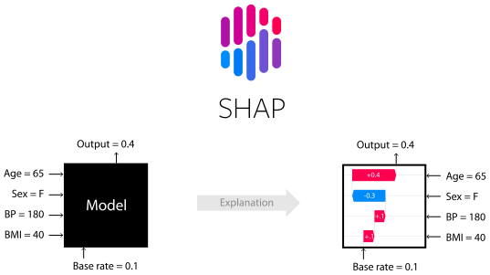
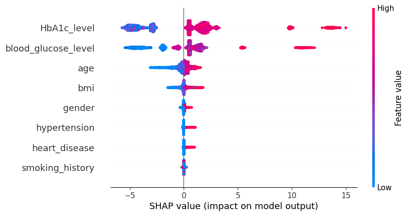
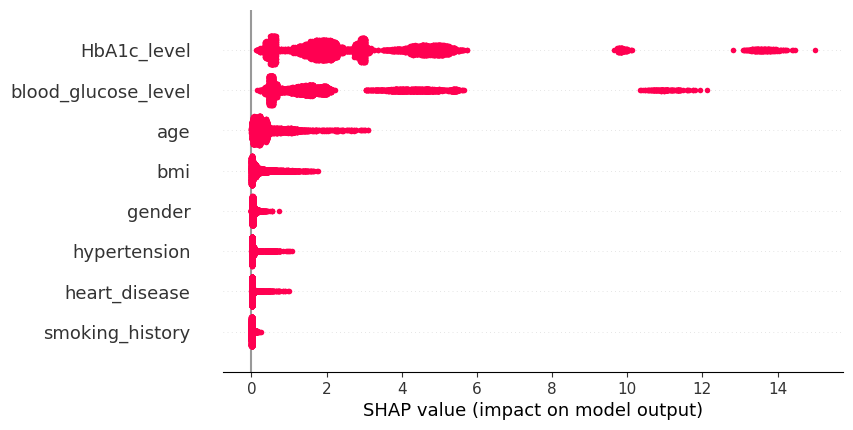
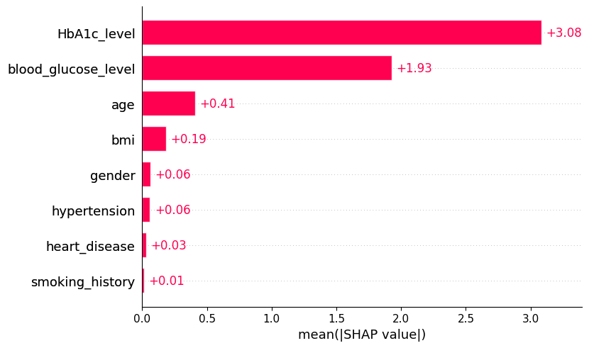
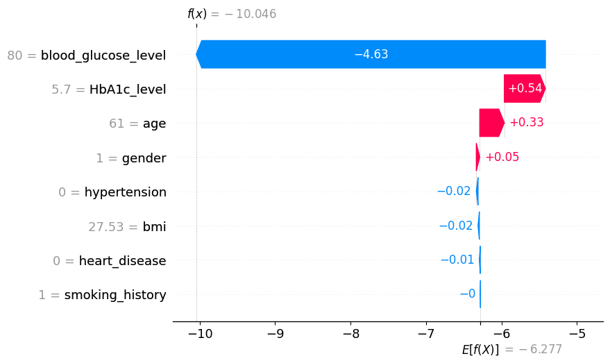

# SHAP (SHapley Additive exPlanations)
## 使用 SHAP 可視化模型結果



在本節中，將介紹如何使用 SHAP (SHapley Additive exPlanations) 來解釋和可視化機器學習模型的預測結果。

# [SHAP Website](https://github.com/shap/shap)

SHAP 提供了一種統一的方法來解釋任何機器學習模型的輸出。
使用 **diabetes_prediction_dataset.csv** 訓練的 **LightGBM** 和乳腺癌數據集來示範。

## 在Jupyter Notebook 環境中安裝SHAP
```python
!pip install -q shap
```

## 導入工具包
```python
import shap
import pandas as pd
import numpy as np
import lightgbm as lgb
from sklearn.model_selection import train_test_split
```

## 載入資料集
```python
# 加載數據集
df = pd.read_csv('diabetes_prediction_dataset.csv')
df.head()

## Preprocessing
df['gender'] = df['gender'].map({'Female': 0, 'Male': 1, 'Other': 2})
df['smoking_history'] = df['smoking_history'].replace(
    {'never': 0, 'No Info': np.nan,
     'current': 1, 'former': 1, 'ever': 1, 'not current': 1
    }
)
df.dropna(inplace=True)
df.head()

## Split Dataset to Train & Test
X = df.drop('diabetes', axis=1)
y = df['diabetes']

X_train, X_test, y_train, y_test = train_test_split(X, y, test_size=0.1, random_state=42)
```

## 初始化並訓練模型
使用LightGBM作為範例
```python
import lightgbm as lgb

model = lgb.LGBMClassifier(verbose=-1, random_seed=12)
model.fit(X_train, y_train)
```

## 使用 SHAP 解釋模型
```python
# 初始化 SHAP Explainer
explainer = shap.TreeExplainer(model)

# 計算 SHAP 值
shap_values = explainer.shap_values(X_test)
```

## 全局可解釋性(Global interpretability)
### 蜜蜂圖(Beeswarm)
- 橫軸（X 軸）：表示 SHAP 值的大小，即每個特徵對模型預測結果的影響。值越大，該特徵對模型輸出的影響越大。SHAP 值為正表示該特徵增加了預測的概率，為負則表示減少了預測的概率。

- 縱軸（Y 軸）：表示模型的特徵。每個點代表該特徵在數據集中一個樣本的 SHAP 值。

- 顏色：點的顏色表示特徵值的大小。顏色從藍色（低值）到紅色（高值）逐漸變化。例如，顏色為紅色的點表示該特徵在該樣本中的值較高。

```python
shap.plots.beeswarm(shap_values)
```



```python
shap.plots.beeswarm(shap_values.abs, color="shap_red")
```



### 柱狀圖(Bar plot)
```python
shap.plots.bar(shap_values,
            #    max_display=30
)
```



## 局部可解釋性(Local interpretability)

- 解釋測試集中的單一預測

### 瀑布圖(WaterFall)

- 說明了每個特徵如何對單一預測做出貢獻
- 將預測推高的特徵顯示為紅色，將預測推低的特徵顯示為藍色。
```python
shap.plots.waterfall(shap_values[0])
```


